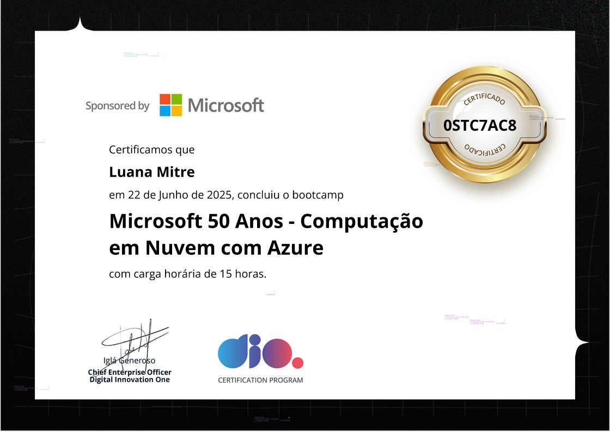

# 🌐☁️ Microsoft 50 Anos - Computação em Nuvem com Azure
Este repositório contem os desafios de projeto propostos no bootcamp "Microsoft 50 Anos - Computação em Nuvem com Azure", da DIO em parceria com a Microsoft.

- Desafio de projeto 01: [resumo_lab](https://github.com/LuuhMitre/bootcamp_computa-o_em_nuvem_azure/tree/main/resumo_lab)
- Desafio de projeto 02: [maquina_virtual](https://github.com/LuuhMitre/bootcamp_computa-o_em_nuvem_azure/tree/main/maquina_virtual)
- Desafio de projeto 03: [database](https://github.com/LuuhMitre/bootcamp_computa-o_em_nuvem_azure/tree/main/database)

### 🎓 Certificado de Conclusão

 
