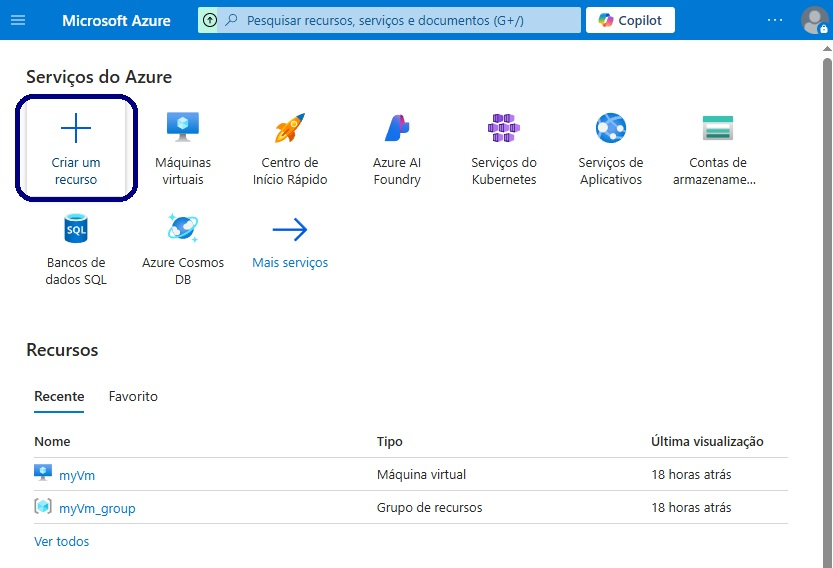
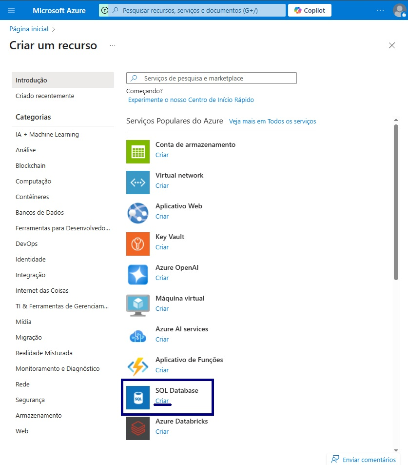
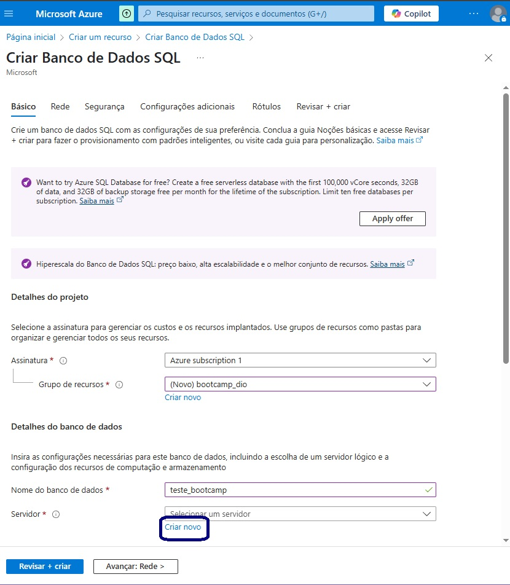
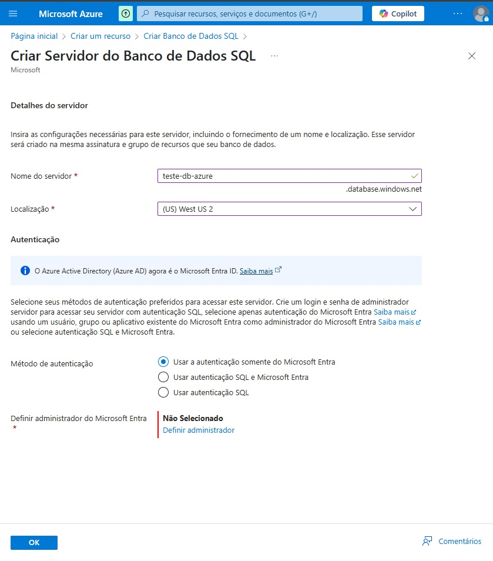
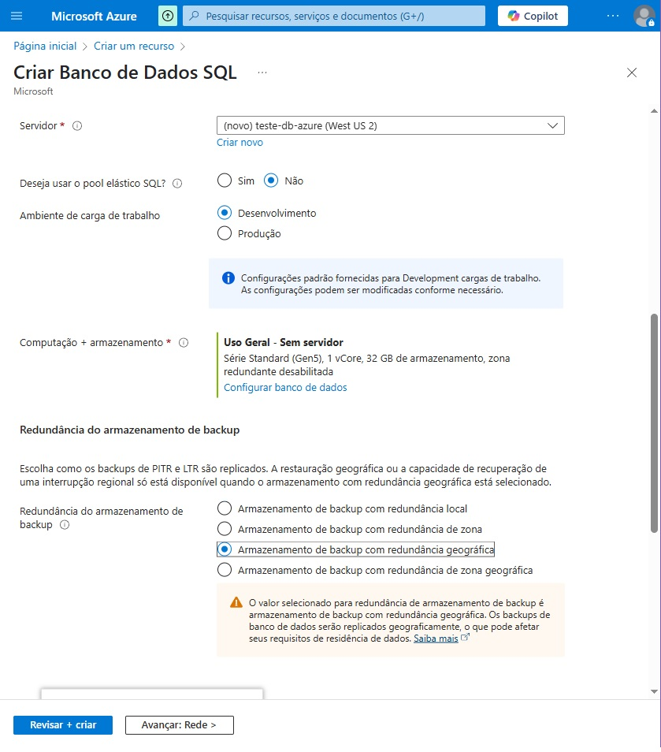
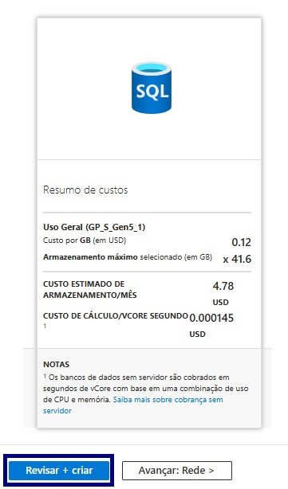
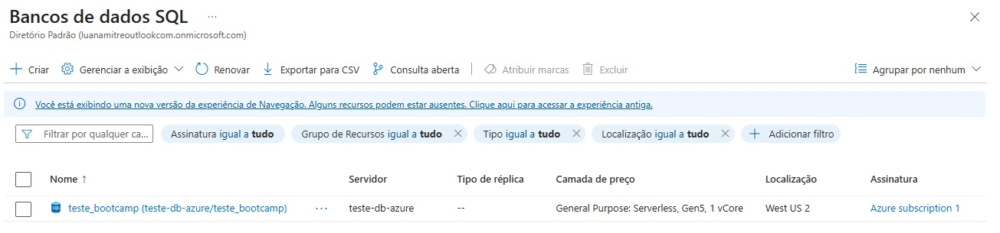

## 🛢️ Configurando uma instância de Banco de Dados na Azure

O terceiro desafio de projeto proposto no bootcamp **Microsoft 50 Anos - Computação em Nuvem com Azure** foi a criação de uma instância de Banco de Dados utilizando a Microsoft Azure.

Este repositório tem como objetivo documentar o passo a passo desse processo, por meio de capturas de tela.

---

### 📝 Passo a Passo

- Clique em **CRIAR UM RECURSO**:  
  

- Em **SQL Database**, clique em **CRIAR**:  
  

- Nesta etapa, será necessário preencher a seção **BÁSICO** de acordo com as características necessárias do Banco de Dados. Como a conta ainda não possui um servidor de Bando de Dados, será necessário clicar em **CRIAR NOVO** : 
  

- Nesta etapa será definido o nome, localização e autenticação do servidor. Cliquar em **OK**:  
  

- Em seguida, retornaremos para a página de configuração do Banco de Dados para concluir o preenchimento das especificações:  
  

- Após o preenchimento das especificações do Banco de Dados, será apresentado um resumo de custos previstos. Para concluir a criação do Banco, clique em **REVISAR + CRIAR**:  
  

- A instância do Banco de Dados será criada e estará disponível na plataforma da Microsoft Azure:  
  
