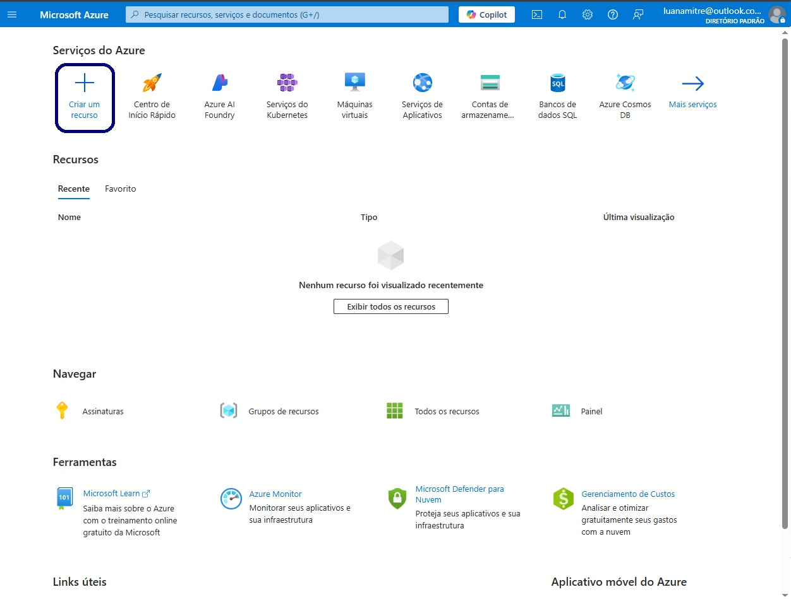
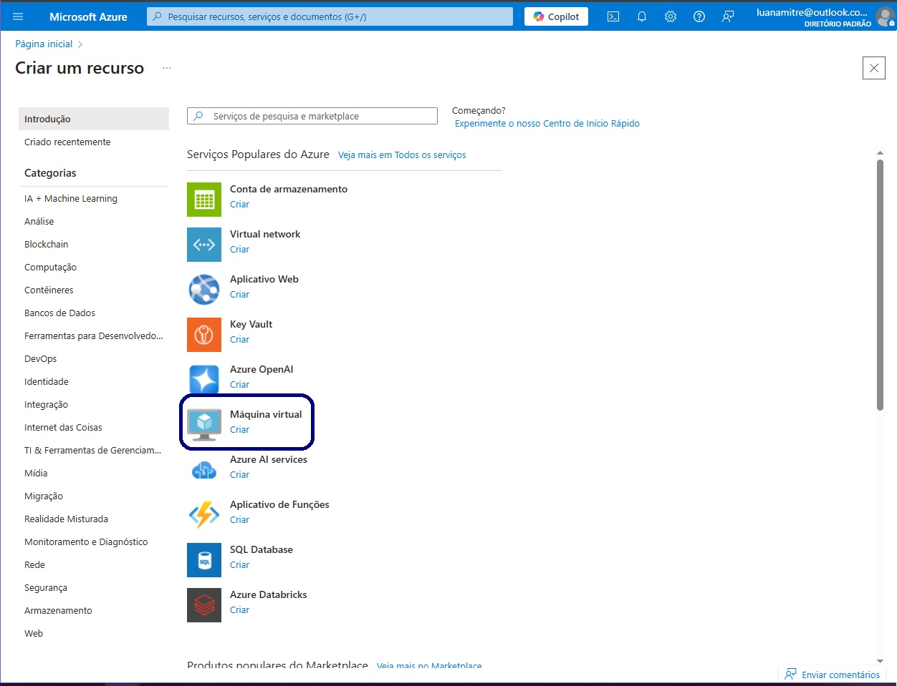
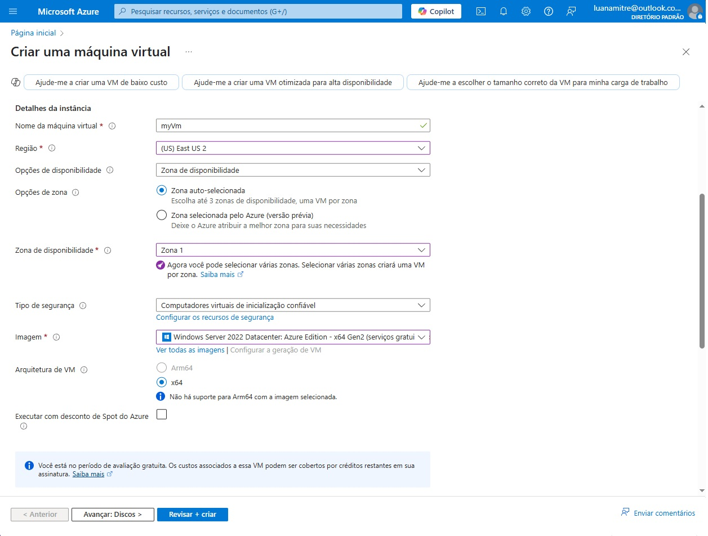
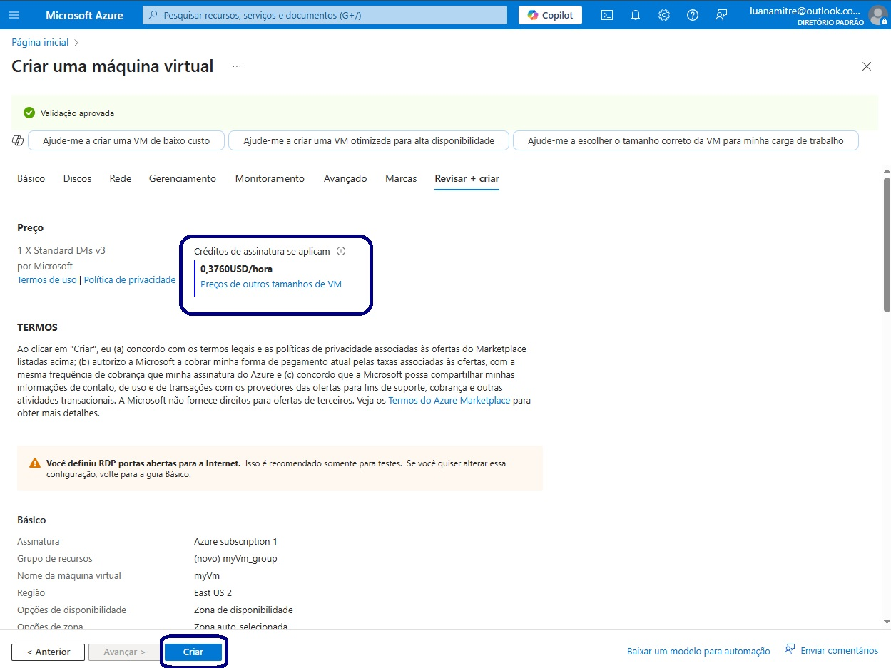
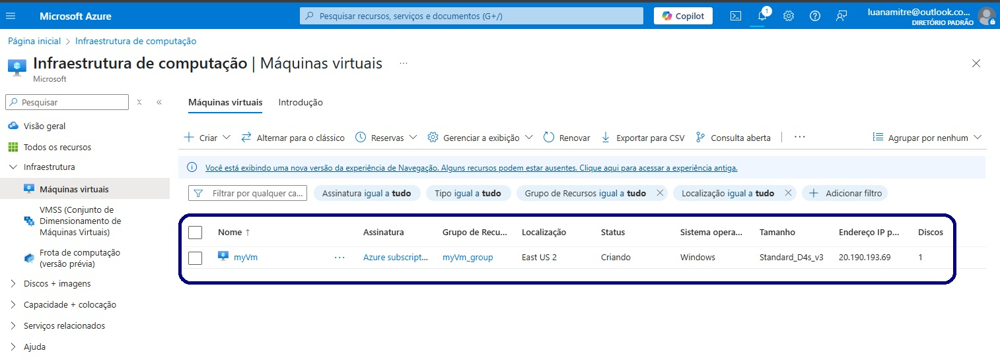

## 🖥️ Criando Máquinas Virtuais na Azure

O segundo desafio de projeto proposto no bootcamp **Microsoft 50 Anos - Computação em Nuvem com Azure** foi a criação de uma máquina virtual utilizando o Microsoft Azure.

Este repositório tem como objetivo documentar o passo a passo desse processo, por meio de capturas de tela.

---

### 📝 Passo a Passo

- Clique em **CRIAR UM RECURSO**:  
  

- Clique em **MÁQUINA VIRTUAL**:  
  

- Preencha a seção **BÁSICO** de acordo com as características necessárias para a máquina virtual:  
  

- Em seguida, clique em **REVISAR + CRIAR**:  
  

- Nesta etapa, é possível conferir as configurações especificadas para a máquina virtual, além do custo por hora dos recursos alocados. Após revisar as informações, clique em **CRIAR**:  
  

- A máquina virtual será criada e estará disponível na plataforma do Microsoft Azure:  
  
